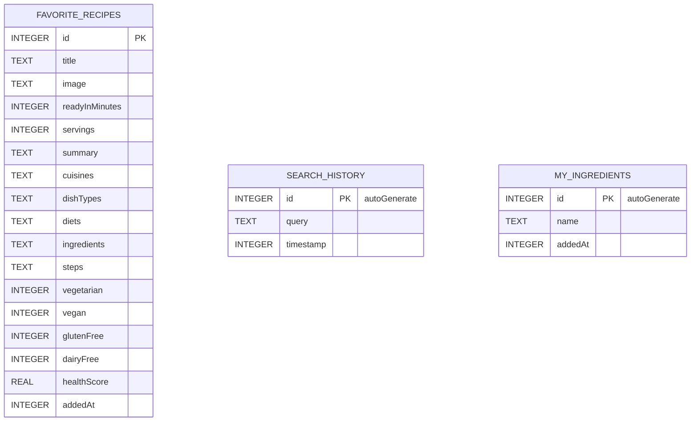

# Схема базы данных

MealHunter использует **Room** (SQLite) с тремя таблицами.

## ER-диаграмма



## SQL-схема

```sql
CREATE TABLE favorite_recipes (
    id              INTEGER PRIMARY KEY,
    title           TEXT    NOT NULL,
    image           TEXT,
    readyInMinutes  INTEGER NOT NULL,
    servings        INTEGER NOT NULL,
    summary         TEXT    NOT NULL,
    cuisines        TEXT    NOT NULL,  -- JSON-массив строк
    dishTypes       TEXT    NOT NULL,  -- JSON-массив строк
    diets           TEXT    NOT NULL,  -- JSON-массив строк
    ingredients     TEXT    NOT NULL,  -- JSON-массив объектов Ingredient
    steps           TEXT    NOT NULL,  -- JSON-массив строк
    vegetarian      INTEGER NOT NULL,
    vegan           INTEGER NOT NULL,
    glutenFree      INTEGER NOT NULL,
    dairyFree       INTEGER NOT NULL,
    healthScore     REAL    NOT NULL,
    addedAt         INTEGER NOT NULL DEFAULT (strftime('%s','now') * 1000)
);

CREATE TABLE search_history (
    id        INTEGER PRIMARY KEY AUTOINCREMENT,
    query     TEXT    NOT NULL,
    timestamp INTEGER NOT NULL DEFAULT (strftime('%s','now') * 1000)
);

CREATE TABLE my_ingredients (
    id      INTEGER PRIMARY KEY AUTOINCREMENT,
    name    TEXT    NOT NULL,
    addedAt INTEGER NOT NULL DEFAULT (strftime('%s','now') * 1000)
);
```

## Примечания

- Поля-коллекции (`cuisines`, `ingredients`, `steps` и др.) хранятся как **JSON-строки** через Gson — лишние таблицы не нужны для простого приложения.
- `search_history` ограничена **20 записями** запросом DAO (`ORDER BY timestamp DESC LIMIT 20`).
- Версия БД — `1`; используется `fallbackToDestructiveMigration` на этапе разработки.
