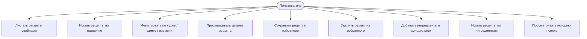

# Требования

## Диаграмма вариантов использования

## Функциональные требования

| ID | Требование |
|----|-----------|
| FR-1 | Приложение отображает случайные рецепты в виде свайп-карточек на главном экране |
| FR-2 | Свайп вправо сохраняет рецепт в избранное |
| FR-3 | Свайп влево пропускает рецепт |
| FR-4 | Приложение поддерживает фильтрацию по кухне, диете, типу блюда и максимальному времени готовки |
| FR-5 | Приложение позволяет искать рецепты по текстовому запросу |
| FR-6 | Приложение сохраняет и отображает историю поисковых запросов |
| FR-7 | Экран деталей отображает: изображение, время, порции, health score, ингредиенты с чекбоксами, пошаговые инструкции |
| FR-8 | Пользователь может переключать статус избранного с экрана деталей |
| FR-9 | Избранное сохраняется локально в базе данных Room |
| FR-10 | Экран Холодильника позволяет добавлять и удалять ингредиенты в виде чипов |
| FR-11 | Экран Холодильника ищет рецепты по добавленным ингредиентам через API |

## Нефункциональные требования

| ID | Требование |
|----|-----------|
| NFR-1 | API-ключ не должен храниться в исходном коде |
| NFR-2 | Приложение должно поддерживать Android 8.0+ (API 26+) |
| NFR-3 | Таймаут сетевых запросов — 30 секунд |
| NFR-4 | Избранное должно быть доступно офлайн |
| NFR-5 | Интерфейс должен соответствовать руководству Material 3 |
| NFR-6 | CI-пайплайн должен собирать рабочий APK при каждом push в main |
